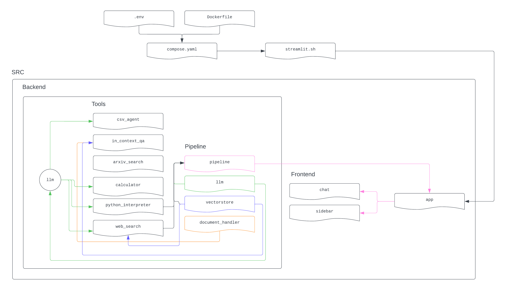

# FIRST: Forest Intellect Research & Technology System

[Viktor Ciroski](https://viktor1223.github.io/ViktorCiroski.github.io/),
[Eugenio Culurciello ](https://www.linkedin.com/in/eugenioculurciello/),
[Pranav Jadhav](jadhav14@purdue.edu),
[Sravani Ramishetty](https://www.linkedin.com/in/sravaniramishetty/),
[Akshath Raghav R](https://www.linkedin.com/in/akshathrr), 
[Alexandre Sauquet](asauquet@purdue.edu),
[Shakti Wadekar](https://www.linkedin.com/in/shakti-nagnath-wadekar/)
<center>Listed in alphabetical order by last name</center>


<br>
Introduction to FIRST: A Forestry Logic-Intensive Task Handling Framework

FIRST, an open-source software package, has been meticulously crafted to offer precise solutions for logic-intensive tasks within the field of forestry. Developed with the cutting-edge technology of Langchain, this framework harnesses a sophisticated suite of forestry tools. Among its capabilities, FIRST excels in predicting changes and distributions in forestry time series, particularly in regions where data may be limited or unknown. This academic-grade software aims to elevate the precision and efficiency of forestry-related analyses, providing a robust platform for addressing complex challenges in the domain.


## ⚠️ Note
Project Status:
This project is currently in the developmental phase and actively undergoing enhancements. The Language Model (LLM) backend is presently powered by GPT-4, with imminent plans to transition towards a multi-modal approach, specifically leveraging the Llama2 Large World Model (LWM).

Tool Integration:
The current iteration of the project features the integration of several tools designed to augment its capabilities:
- **Arxiv Search:** Facilitating exploration and retrieval of scholarly articles.
- **Web Browser:** Enabling web-based research and information gathering.
- **Calculator:** Providing computational functionality within the environment.
- **Python Interpreter:** Supporting the execution of Python code for enhanced scripting capabilities.
- **In-context QA:** Offering question-answering functionality within the context of the project.
- **Data Chat:** Enabling data visualization and analysis support of uploaded CSV files. 

Modality Focus:
It's important to note that the current implementation is tailored for a singular modality, specifically text. Future iterations aim to broaden the scope by incorporating a multi-modal approach, thereby enhancing the project's capacity to process and analyze diverse types of data.

Try it our [FIRST DEMO]()


## Forestry QA Dataset

We present the Forestry QA dataset, a comprehensive collection tailored for advancing the field of forestry-related question answering. This dataset encompasses a curated set of question-answer pairs derived from forestry examinations, providing real-world scenarios to test and enhance models in the domain. Additionally, the dataset incorporates question-answer pairs sourced from forestry textbooks, generated using the sophisticated language model GPT3.5. This amalgamation ensures a diverse and robust dataset, fostering the development and evaluation of question answering systems tailored specifically for forestry applications. Researchers and practitioners can utilize this dataset to benchmark their models, foster innovation, and contribute to the continuous improvement of question answering capabilities in the context of forestry.

⚠️ Future plans are to generate a multi-modal QA Dataset ⚠️

| Data File Name | File Size | Sample Size |
|----------------|-----------|-------------|
| TreeHugger_Exam_ans.csv      | 1 MB     | 49        |
| Multi-modal QA    | TBD MB      | TBH         |


## FIRST: Forestry Intellect Research & Technology System 
At the present stage of development, our focus is not directed towards training the model; rather, we are leveraging the capabilities of GPT-4 within the ReACT framework to facilitate seamless interaction with various tools. Our approach involves utilizing GPT-4 as a proficient language model to enhance the functionality of the ReACT framework.

Future endeavors, however, will delve into more advanced training methodologies. Specifically, our roadmap includes exploring the training of Llama2 for multimodal capabilities within the ReACT framework. This strategic shift aims to further elevate the project's capacity to process and comprehend diverse data types, laying the groundwork for a more comprehensive and versatile system.
### Performance 
#### Forestry QA Data 
)

# Project Setup Guide

This guide provides detailed instructions on how to set up and run the Forestry_Student project. By following these steps, you'll be able to clone the repository, configure necessary environment variables, and start the application using Docker.



## Prerequisites

Before you begin, ensure you have the following installed on your system:
- [Git](https://git-scm.com/book/en/v2/Getting-Started-Installing-Git)
- [Docker](https://docs.docker.com/engine/install/)
- [Docker Compose](https://docs.docker.com/compose/install/)

## Installation

Clone the Forestry_Student repository and navigate into the project directory:

```bash
git clone https://github.com/e-lab/Forestry_Student.git
cd Forestry_Student
```

## Configuration

Create a `.env` file in the root directory of the project. This file should contain the necessary API keys for the application to function properly. Replace `<YOUR_GOOGLE_API_KEY>`, `<YOUR_GOOGLE_CSE_ID>`, and `<YOUR_OPENAI_API_KEY>` with your actual API keys.

```plaintext
# .env file
GOOGLE_API_KEY=<YOUR_GOOGLE_API_KEY>
GOOGLE_CSE_ID=<YOUR_GOOGLE_CSE_ID>
OPENAI_API_KEY=<YOUR_OPENAI_API_KEY>
```

### Obtaining API Keys

- **Google API Key & CSE ID**: Follow Google's documentation to [create an API key](https://support.google.com/googleapi/answer/6158862?hl=en) and [set up a Custom Search Engine (CSE)](https://programmablesearchengine.google.com/controlpanel/create).
- **OpenAI API Key**: Follow these instructions [to get your OpenAI key](https://www.maisieai.com/help/how-to-get-an-openai-api-key-for-chatgpt). Instead, log in to your OpenAI account and navigate to the API section to find your key.

## Startup

To build and start the application using Docker Compose, run the following command in the terminal:

```bash
docker-compose up --build
```

This command builds the Docker images and starts the containers defined in your `docker-compose.yaml` file. If this is the first time you're running the command, it might take some time to download the necessary images and dependencies.

## Accessing the Application

Once the application is running, you can access the web interface by opening your web browser and navigating to:

```
http://localhost:8501
```

## Troubleshooting

- If you encounter any issues with Docker, ensure Docker is running on your system and try restarting it.
- For problems related to API keys, double-check that they are correctly entered in the `.env` file with no extra spaces or characters.

## Acknowledgement 
This project has been undertaken in the Eugenio Culurciello e-lab at Purdue University, in collaboration with the FACAI lab. We extend our sincere appreciation to both labs for their invaluable contributions and collaborative efforts. Furthermore, we acknowledge and express gratitude for the resources generously provided by the Purdue Institute of Physical AI, which have played a crucial role in supporting and advancing our research endeavors.

## Citation 

```
@software{FIRST,
author = {Ciroski, Viktor and Culurciello, Eugenio and Jadhav, Pranav and Ramishetty, Sravani and Ravikiran, Akshath Raghav and Sauquet, Alexandre and Wadekar, Shakti},
title = {{Forest Intellect Research & Technology System}},
url = {https://github.com/e-lab/Forestry_Student/tree/main},
version = {0.0.1}
}
```